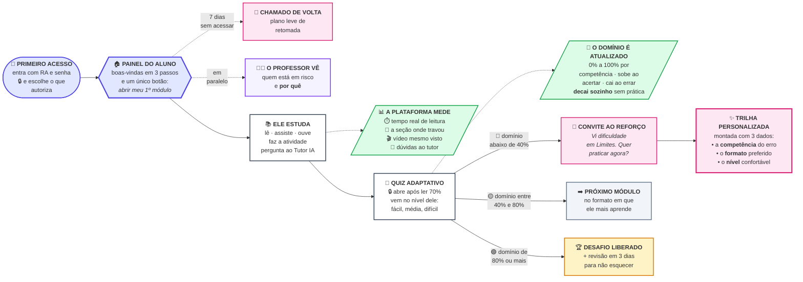

# O Caminho do Aluno na Plataforma EduBot

### Legenda das cores

| Cor | O que representa |
|---|---|
| 🟦 **Azul** | Entrada e painel do aluno |
| ⬜ **Branco** | O que o **aluno faz** |
| 🟩 **Verde** | **Dados** que a plataforma coleta e calcula |
| 🟪 **Rosa** | **Ações do EduBot** — quando a IA fala com o aluno |
| 🟨 **Amarelo** | Conquistas e desafios |
| 🟣 **Roxo** | O que chega ao **professor** |

### Como narrar em 5 frases

1. **O aluno entra e escolhe o que autoriza** — privacidade primeiro, antes de qualquer coleta.
2. **Ele estuda, e a plataforma mede o que realmente aconteceu** — tempo com a aba visível, seção onde travou, vídeo de fato assistido. Pular não conta.
3. **O quiz só abre depois da leitura**, e vem no nível certo para ele.
4. **Cada resposta atualiza o domínio da competência** — uma nota de 0 a 100% que sobe, cai e até decai sozinha com o esquecimento. É esse número que decide o próximo passo.
5. **Dificuldade vira trilha personalizada; domínio vira desafio e revisão; ausência vira convite de volta** — e o professor vê tudo isso, com o motivo explicado.
