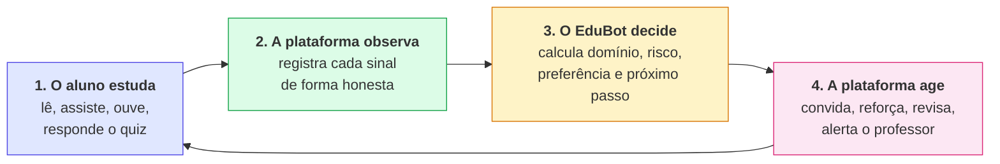
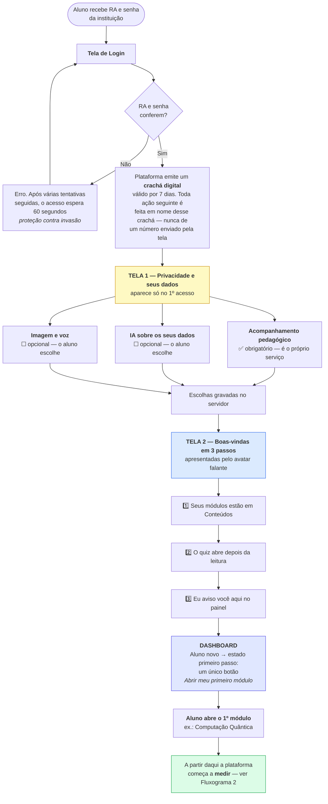
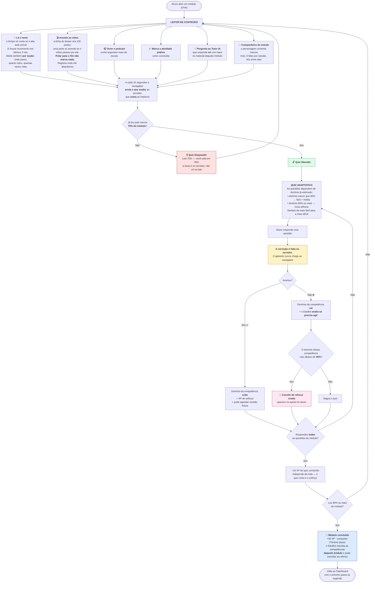
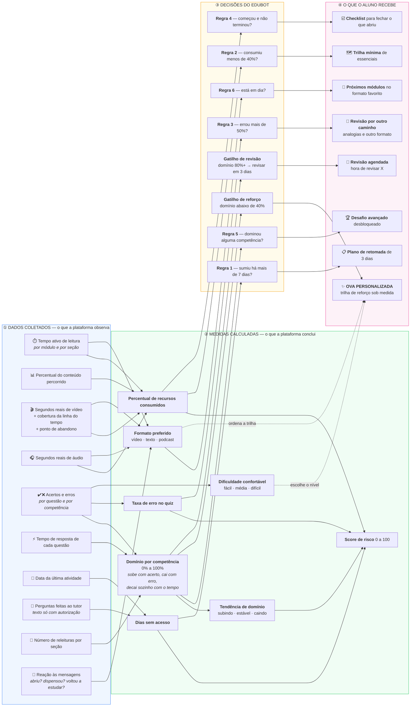
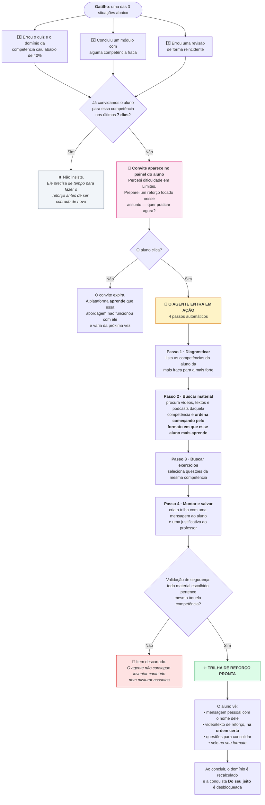
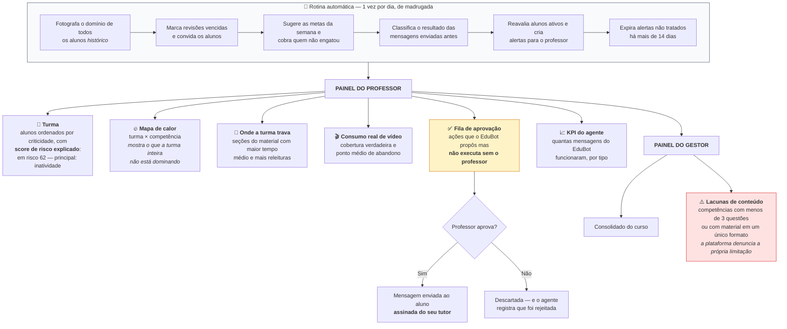

# EduBot — Regras de Negócio e Jornada do Aluno

> **Documento de apresentação.** Explica, em linguagem acessível a público não técnico,
> **o que a plataforma faz**, **quais dados ela usa**, **como esses dados viram uma trilha
> personalizada** e **qual é o caminho do aluno** — do primeiro acesso ao uso contínuo.
>
> Data: 24/08/2026 · Projeto de referência: **EduBot** · Base: código-fonte auditado.

---

## Sumário

1. [Qual é o projeto atual](#0-qual-é-o-projeto-atual-edubot)
2. [O que é a plataforma](#1-o-que-é-a-plataforma-em-uma-frase)
3. [O ciclo em quatro tempos](#2-o-ciclo-em-quatro-tempos-a-ideia-central)
4. [**FLUXOGRAMA 1** — O aluno que está chegando agora](#3-fluxograma-1--o-aluno-que-está-chegando-agora)
5. [**FLUXOGRAMA 2** — O dia a dia dentro de um módulo](#4-fluxograma-2--o-dia-a-dia-o-aluno-dentro-de-um-módulo)
6. [**FLUXOGRAMA 3** — Como os DADOS viram trilha personalizada](#5-fluxograma-3--como-os-dados-viram-uma-trilha-personalizada)
7. [**FLUXOGRAMA 4** — Como a OVA Personalizada é montada](#6-fluxograma-4--como-a-ova-personalizada-é-montada-o-momento-de-maior-impacto)
8. [**FLUXOGRAMA 5** — O professor e o gestor](#7-fluxograma-5--o-professor-e-o-gestor)
9. [Catálogo de dados coletados](#8-catálogo-de-dados-coletados)
10. [Regras de negócio implementadas](#9-regras-de-negócio-implementadas-catálogo-completo)
11. [Painel de parâmetros pedagógicos](#10-painel-de-parâmetros-pedagógicos)
12. [Glossário para não técnicos](#11-glossário-para-não-técnicos)

---

## 0. Qual é o projeto atual: **EduBot**

Existem duas pastas no repositório. A verificação técnica é conclusiva:

| Critério | **EduBot** ✅ | OVA-IA (legado) |
|---|---|---|
| Último commit | **09/08/2026 18:14** — `feat(rastreamento): fases 0-4 do plano de rastreabilidade` | 09/08/2026 15:09 |
| Código de backend | **8.963 linhas** em 86 arquivos | 4.386 linhas em 60 arquivos |
| Migrações de banco | **20** (001 a 020) | 2 (001 e 002) |
| Testes automatizados | **258 testes** em 41 arquivos | suíte parcial |
| Endpoints da API | **50 rotas** | subconjunto |
| Funcionalidades exclusivas | Rastreio por seção, consumo real de vídeo, modelo de domínio (BKT), revisão espaçada, gamificação, metas semanais, risco composto, governança do agente, painel do gestor | — |

**Conclusão:** o **EduBot** é a versão atual e evoluída. O `OVA-IA` é o repositório original,
do qual o EduBot foi derivado — ele parou nas fases iniciais da auditoria. **Toda a
apresentação deve usar o EduBot.**

---

## 1. O que é a plataforma, em uma frase

> O EduBot é um **Ambiente Virtual de Aprendizagem que observa como cada aluno estuda** —
> o que ele lê, assiste, acerta, erra e esquece — e usa esses sinais para **montar trilhas
> de estudo individuais**, **avisar o aluno na hora certa** e **entregar ao professor um
> retrato honesto da turma**.

A plataforma tem **três públicos**:

| Papel | O que ele vê | Onde isso vive no código |
|---|---|---|
| **Aluno** | Dashboard, Conteúdos, Atividades, Quiz, Reforço, Meu Desempenho, Professor Mediador | `Front-End/react-logic-demo/src/components/` |
| **Professor / Tutor** | Turma, alertas, mapa de calor de competências, "onde a turma trava", fila de aprovação | `Back-End/edubot/api/routes/tutorRoute.py` |
| **Gestor** | Visão consolidada do curso, cobertura de conteúdo, KPI do agente | `components/ManagerDashboard.tsx` |

**Conteúdo de exemplo (seed):** curso de *Engenharia de Computação*, com 3 disciplinas
(*Computação Quântica*, *Cálculo* e *Fundamentos de Computação na Nuvem*), **4 módulos
(OVAs)**, **9 competências**, 32 questões, 39 recursos e 500 alunos cadastrados
(RA `2` = tutor, RA `4` = admin).

---

## 2. O ciclo em quatro tempos (a ideia central)

O documento inteiro é o detalhamento desses quatro tempos.

---

## 3. FLUXOGRAMA 1 — O aluno que está chegando agora

Este é o caminho de um aluno no **primeiro dia**, do login até a primeira recomendação.

### O que já mudou para esse aluno no primeiro minuto

- Ele tem **consentimentos registrados** — a base legal para tudo que vem depois.
- Ele tem uma **estimativa inicial de domínio de 20%** em cada competência do curso. É o
  ponto de partida do modelo: ele ainda não estudou, então a plataforma **assume que ele
  não sabe** e vai corrigir isso com evidência.
- Ele **não vê ranking, metas nem conquistas ainda** — esses elementos só ganham sentido
  quando existe atividade.
- O dashboard mostra o **estado de boas-vindas** (um único botão), e não painéis vazios.

---

## 4. FLUXOGRAMA 2 — O dia a dia: o aluno dentro de um módulo

Este é o fluxo que se repete. É aqui que **quase todos os dados nascem**.

---

## 5. FLUXOGRAMA 3 — Como os DADOS viram uma trilha personalizada

**Este é o diagrama-chave da apresentação.** Ele mostra, da esquerda para a direita, o
caminho completo: sinal bruto → medida → decisão → ação visível para o aluno.

### Como ler este diagrama numa apresentação

1. **À esquerda, nada é opinião.** São eventos medidos no navegador do aluno, com regras
   que impedem a métrica de mentir: aba oculta não conta tempo; pular o vídeo não conta
   como assistido.
2. **No meio, os dados viram conhecimento sobre o aluno.** A medida mais importante é o
   **domínio por competência** — um número entre 0% e 100% que resume *"quanto este aluno
   sabe deste assunto agora"*.
3. **À direita, o conhecimento vira ação.** Cada ação é rastreável até a regra e até os
   números que a dispararam — o professor sempre pode perguntar **"por quê?"** e obter a
   resposta por escrito.

### Exemplo concreto para narrar na banca

> A aluna Yasmin leu 100% do módulo *Cálculo* (a plataforma contou **14 minutos ativos**,
> descartando 6 minutos em que a aba ficou em segundo plano). Ela assistiu **82% reais** do
> vídeo — não os 100% que apareceriam se contássemos apenas a posição do player, porque ela
> pulou o final. No quiz, errou 4 das 5 questões da competência *Limites*. O domínio dela
> nessa competência caiu de 0,52 para **0,31**. Como 0,31 está abaixo do limiar de 0,40, o
> EduBot criou um **convite de reforço** apontando exatamente para *Limites*. Ela clicou. O
> agente montou uma trilha começando por **vídeo** — porque o histórico mostra que Yasmin
> **conclui** vídeos com muito mais frequência do que textos.

---

## 6. FLUXOGRAMA 4 — Como a OVA Personalizada é montada (o momento de maior impacto)

Quando o aluno tem dificuldade real numa competência, a plataforma **monta um módulo novo,
só para ele**. Este é o passo a passo:

> **Decisão de projeto importante para a banca:** a trilha **não é gerada automaticamente**
> no momento do gatilho — ela é gerada **no clique do aluno**. Motivo: gerar a trilha
> consome processamento de IA, e não há garantia de que o aluno vá usá-la. O que a
> plataforma faz automaticamente é **chamar o aluno, com o assunto certo já decidido**.
> Isso resolve o problema pedagógico clássico: *o aluno que mais precisa de reforço é
> justamente o que não vai atrás dele.*

---

## 7. FLUXOGRAMA 5 — O professor e o gestor

---

## 8. Catálogo de dados coletados

> Esta é a tabela para responder à pergunta **"quais dados vocês usam?"**.

### 8.1 Dados de identificação e matrícula

| Dado | Origem | Para que serve |
|---|---|---|
| RA, nome, curso | Cadastro institucional | Identificar o aluno e definir quais módulos/competências ele vê |
| Papel (aluno / tutor / admin) | Cadastro | Liberar ou bloquear painéis |
| Apelido e título | Escolha do aluno | Aparecer no ranking sem expor o nome real |
| Persona do companheiro | Escolha do aluno | Estilo do personagem que o acompanha |

### 8.2 Dados de consumo de conteúdo — *o coração do rastreamento*

| Dado | Como é medido | Cuidado que torna o dado honesto |
|---|---|---|
| **Tempo ativo de leitura** | Contador de 1 s no navegador, enviado em blocos de 15 s e **somado** no servidor | Só conta com a **aba visível** e com **atividade nos últimos 3 minutos** |
| **% do conteúdo percorrido** | Marca d'água do scroll sobre o conteúdo | Nunca retrocede; página curta conta como lida após 20 s |
| **Tempo por seção do módulo** | Detecta qual seção está na tela; se duas estão visíveis, **divide** o segundo entre elas | Impede que a soma das partes ultrapasse o todo |
| **Releituras por seção** | Conta quantas vezes o aluno **entrou** na seção | Só conta se ficou pelo menos 1 segundo (rolagem rápida não é leitura) |
| **Segundos reais de vídeo** | Conta só com o vídeo tocando **e** a aba visível | Replay conta — é consumo real |
| **Cobertura do vídeo** | A linha do tempo vira **100 baldes**; um balde acende quando a reprodução passa por ele | **Pular para o fim não acende balde nenhum** |
| **Ponto de abandono do vídeo** | Última e maior posição atingida | Mostra ao professor onde a turma larga o vídeo |
| **Velocidade de reprodução** | Última velocidade observada | Sinal de familiaridade com o conteúdo |
| **Segundos de podcast** | Tempo real de escuta | — |
| **Atividade prática concluída** | Botão explícito do aluno | — |

### 8.3 Dados de desempenho

| Dado | Como é medido |
|---|---|
| **Tentativas certas e erradas** | Toda resposta é corrigida **no servidor**; o gabarito nunca vai ao navegador |
| **Primeira resposta correta** | Guardada separadamente (define "competência trabalhada") |
| **Tempo de resposta por questão** | Do momento em que a questão apareceu até o envio — é o sinal de esforço |
| **Nível de dificuldade** de cada questão | Fácil (1), Média (2), Difícil (3) |

> **Proteção contra distorção:** se o aluno clica duas vezes em "Verificar" na mesma
> questão já acertada, a segunda **não** vira uma nova tentativa. Sem essa regra, a taxa
> de erro da turma inteira seria falsa.

### 8.4 Dados de interação e engajamento

| Dado | Observação |
|---|---|
| **Perguntas ao Tutor IA** | O **texto** só é guardado com o consentimento "IA sobre os seus dados". Sem ele, guarda-se apenas *que houve* uma pergunta |
| **Interação com o companheiro** | Falou, ouviu, dispensou, pediu explicação |
| **Janelas de ociosidade** | Início e fim de períodos ausentes durante a leitura |
| **Login** | Marca presença mesmo sem estudo |
| **Recebeu / dispensou intervenção** | Base para saber se a mensagem funcionou |

### 8.5 Dados derivados — *calculados, não coletados*

| Medida | Como nasce |
|---|---|
| **Domínio por competência (0–100%)** | Modelo estatístico BKT, atualizado a cada resposta |
| **Histórico diário de domínio** | Uma "fotografia" por dia — permite mostrar setas de tendência |
| **Dias sem acesso** | O maior valor entre **5 fontes**: interações, leitura, mídia, tentativas e eventos |
| **Formato preferido** | Formato que o aluno mais **conclui** (não o que mais começa) |
| **Dificuldade confortável** | Nível em que ele tem a melhor taxa de acerto |
| **Score de risco** | Combinação ponderada de 5 sinais |
| **Cobertura de conteúdo** | Quantas questões e quantos formatos existem por competência |

### 8.6 Dados de governança da IA

| Dado | Para que serve |
|---|---|
| **Trilha de decisões do agente** | Toda decisão fica registrada com o resumo dos números que a motivaram |
| **Resultado de cada decisão** | Classificado depois como *melhorou · aceita · dispensada · expirada* |
| **Custo estimado por chamada** | Controle de orçamento diário de IA |
| **Consentimentos** | Estado atual, data de concessão e de revogação |

---

## 9. Regras de negócio implementadas (catálogo completo)

### RN-A · Acesso e identidade

| # | Regra |
|---|---|
| A1 | O login é por **RA + senha**. A senha é guardada como **hash PBKDF2-SHA256** com sal individual — nunca em texto legível. |
| A2 | Senhas antigas em texto plano são aceitas **uma única vez** e reescritas como hash no próprio login. |
| A3 | Após tentativas repetidas de login errado (por RA e por origem), o acesso é **bloqueado por 60 segundos**. |
| A4 | O login emite um **token assinado válido por 7 dias**. Toda rota protegida resolve o aluno **a partir do token**, jamais de um identificador enviado pela tela. |
| A5 | Um aluno **nunca** consegue ler ou escrever dados de outro. Pedir uma trilha de outro aluno retorna "não encontrado" — sem revelar que ela existe. |
| A6 | O papel do usuário define a navegação: aluno vê 7 abas; tutor e admin veem Conteúdos, Turma e Visão do Gestor. |

### RN-B · Privacidade e LGPD

| # | Regra |
|---|---|
| B1 | Existem **4 finalidades** de tratamento: *acompanhamento pedagógico*, *IA sobre os dados*, *imagem e voz* e *ranking da turma*. |
| B2 | O **acompanhamento pedagógico** é informado, não opcional — é a própria execução do contrato educacional. Ele não pode ser revogado. |
| B3 | As outras três são **opt-in revogáveis**: vêm desmarcadas e podem ser desligadas a qualquer momento em "Meus dados". |
| B4 | **Sem o consentimento de IA:** o texto das perguntas ao tutor **não é guardado**, e o agente roda **apenas com regras determinísticas** — nenhum dado do aluno é enviado a um modelo de linguagem. |
| B5 | A minimização é feita **no servidor**, não na interface — desligar a tela não burla a regra. |
| B6 | Os resumos enviados ao modelo de IA são **minimizados**: apenas o primeiro nome e as métricas que motivaram a decisão. Nunca RA, nome completo ou dados sensíveis. |
| B7 | O consentimento gravado no servidor é a **fonte da verdade**; a marca no navegador é apenas cache. Trocar de navegador faz o aviso reaparecer. |
| B8 | Revogar o consentimento de ranking **esconde o aluno imediatamente** da lista. |

### RN-C · Rastreamento de consumo

| # | Regra |
|---|---|
| C1 | O tempo de leitura só é contado com a **aba visível** e com **atividade nos últimos 180 segundos**. |
| C2 | O navegador envia o **acréscimo** de tempo desde o último envio (a cada 15 s e ao fechar a página); o servidor **soma**. Duas abas do mesmo aluno somam corretamente, sem uma sobrescrever a outra. |
| C3 | O percentual de scroll é uma **marca d'água**: só sobe, nunca desce. |
| C4 | O módulo é considerado **concluído** com 90% de scroll — ou, se a página couber inteira na tela, após 20 segundos de permanência. |
| C5 | **Vídeo:** a linha do tempo é dividida em **100 baldes**; um balde só acende com reprodução passando por ele. Pular não acende. |
| C6 | Vídeo e podcast são **concluídos com 90% de cobertura real**. |
| C7 | O navegador envia o **mapa acumulado** de baldes e o servidor faz a união com o já salvo — se um envio se perder, o próximo recompõe (auto-correção). |
| C8 | **Por seção:** quando duas seções estão visíveis, o segundo é **dividido** entre elas. Isso garante que a soma das seções nunca ultrapasse o tempo total do módulo. |
| C9 | Uma seção só conta como "visitada" após **1 segundo** visível — rolagem rápida não é leitura. |
| C10 | Textos são considerados consumidos com **80%** de leitura; vídeos e podcasts com **90%**. |
| C11 | Os eventos de aprendizagem seguem um **vocabulário fechado** (abriu, leu, tocou, respondeu, perguntou ao tutor, dispensou…). Evento fora do vocabulário é rejeitado — e a rejeição é visível, não silenciosa. |
| C12 | Lotes de até **50 eventos** por envio; um item inválido não derruba o lote inteiro. |
| C13 | Horários enviados pelo navegador são **convertidos para o fuso local** antes de gravar — senão eventos apareceriam 3 horas no futuro e distorceriam a contagem de inatividade. |

### RN-D · Quiz e avaliação

| # | Regra |
|---|---|
| D1 | **Trava de conteúdo:** o quiz do módulo só abre depois de o aluno ler **70%** do material. A trava é validada **no servidor**, tanto na listagem quanto na correção. |
| D2 | Um módulo pode desligar a trava (valor 0) — para conteúdos curtos ou introdutórios. |
| D3 | **A correção é 100% no servidor.** O gabarito nunca é enviado ao navegador. |
| D4 | **Pool adaptativo:** o teto de dificuldade sai do domínio da competência. Abaixo de 80% → só fácil e média. A partir de 80% → inclui difíceis. |
| D5 | As questões são servidas **da mais fácil para a mais difícil**. |
| D6 | O quiz **nunca fica vazio**: se o filtro eliminar tudo, o pool original é devolvido. |
| D7 | **Modo desafio:** só questões difíceis de competências que o aluno **já domina**. Sem material, o modo fica bloqueado. |
| D8 | **Idempotência:** reenviar a mesma resposta correta de uma questão já acertada **não** gera nova tentativa. Retentativas reais continuam contando. |
| D9 | O tutor ou o agente podem definir um **nível-alvo** de dificuldade por competência, com teto de **1 ajuste por dia**. |

### RN-E · Modelo de domínio do aluno (BKT)

| # | Regra |
|---|---|
| E1 | Cada par (aluno, competência) tem um **domínio estimado** entre 0 e 1, atualizado a cada resposta pelo modelo **Bayesian Knowledge Tracing**. |
| E2 | O modelo tem 4 parâmetros pedagógicos: domínio inicial **20%**, chance de aprender **15%**, chance de errar sabendo (deslize) **10%**, chance de acertar sem saber (chute) **25%**. |
| E3 | **Esquecimento:** o domínio **decai 2% por semana sem prática**, aproximando-se do valor inicial. Quem dominava e sumiu volta com estimativa menor. |
| E4 | Os três rótulos da interface derivam do número: **abaixo de 40%** = não iniciada · **40% a 80%** = em desenvolvimento · **80% ou mais** = desenvolvida. |
| E5 | **Degradação segura:** onde ainda não há sinal, o sistema usa a razão acertos/total (limiar 80%) — o perfil nunca fica sem status. |
| E6 | Uma **fotografia diária** do domínio é gravada, permitindo mostrar tendência (subindo / estável / caindo) numa janela de 7 dias. |

### RN-F · Revisão espaçada (memória de longo prazo)

| # | Regra |
|---|---|
| F1 | Quando o domínio cruza **80%**, a plataforma agenda automaticamente a **primeira revisão em 3 dias**. |
| F2 | Cada par (aluno, competência) tem **no máximo uma revisão ativa** por vez. |
| F3 | **Acertou na data (ou depois):** o intervalo é multiplicado pelo fator de facilidade (começa em 2,5) — teto de **60 dias**. |
| F4 | **Errou:** o intervalo volta para **1 dia** e o fator de facilidade cai 0,2 (piso 1,3). |
| F5 | Responder **fora da data** não altera o agendamento. |
| F6 | A varredura diária marca as revisões vencidas e cria **uma única mensagem por aluno**: *"Hora de revisar: X, Y"*. |
| F7 | Revisar **em dia** concede XP — é esforço reconhecido. |
| F8 | Quando o fator de facilidade chega ao **piso**, o aluno está errando de forma reincidente → dispara o **gatilho 3 do reforço**. |

### RN-G · Agente proativo — as 6 regras de decisão

O EduBot avalia o perfil e aplica a **primeira regra satisfeita**, nesta ordem:

| Ordem | Condição | Recomendação gerada | Prioridade |
|---|---|---|---|
| **1** | Sem acessar há **mais de 7 dias** | **Plano de retomada** gradual e acolhedor em 3 dias | Alta |
| **2** | Consumiu **menos de 40%** dos recursos | **Trilha mínima** de itens essenciais | Alta |
| **3** | Taxa de erro **acima de 50%** | **Revisão com explicação alternativa** — analogias, outro formato | Média |
| **4** | Acessou mas **não concluiu** módulos | **Checklist** passo a passo para fechar o ciclo | Média |
| **5** | Alguma competência **desenvolvida** | **Desafio avançado** desbloqueado | Baixa |
| **6** | Nada a corrigir | **Próximos módulos no formato de maior engajamento** | Baixa |

**Regras de operação do agente:**

| # | Regra |
|---|---|
| G1 | Só recomendações de prioridade **alta ou média** viram mensagem ao aluno — o resto é informativo. |
| G2 | O agente age em **3 momentos**: por evento (erro no quiz, conclusão de módulo), por varredura diária, e sob demanda (clique do aluno). |
| G3 | **Controle de custo:** se o aluno já tem mensagem pendente **criada hoje**, o gatilho por evento é pulado — um quiz com 5 erros não gera 5 mensagens. |
| G4 | Mensagens ao aluno são **deduplicadas por (aluno, tipo, dia)**. Alertas ao professor, por (aluno, tipo) enquanto não lidos. |
| G5 | Alertas não tratados **expiram em 14 dias** — senão travariam para sempre novos alertas do mesmo tipo. |
| G6 | A varredura considera apenas alunos **com atividade** — não varre a base inteira. |
| G7 | O **texto** da mensagem pode ser redigido por IA para o caso concreto, usando as últimas perguntas ao tutor e o histórico de reação do aluno. Se a IA falhar, um **texto padrão** é usado — o aluno nunca fica sem mensagem. |
| G8 | A **regra decide o quê**; a IA decide apenas **como dizer**. A decisão pedagógica nunca depende do modelo de linguagem. |

### RN-H · Reforço e OVA Personalizada

| # | Regra |
|---|---|
| H1 | **Três gatilhos** criam o convite de reforço: (1) erro no quiz que derruba o domínio abaixo de **40%**; (2) conclusão de módulo com competência fraca; (3) erro reincidente em revisão. |
| H2 | O gatilho 2 avalia **apenas as competências daquele módulo** — terminar Cálculo não gera reforço de Computação Quântica. |
| H3 | **Cooldown de 7 dias** por competência: o aluno precisa de tempo para fazer o reforço antes de ser cobrado de novo. |
| H4 | A trilha é gerada **no clique do aluno**, não no gatilho — por controle de custo e porque o convite já carrega o assunto certo. |
| H5 | O agente executa **4 ferramentas em sequência**: diagnosticar competências fracas → buscar material de remediação → buscar questões → montar e salvar a trilha. |
| H6 | **Validação obrigatória:** todo material escolhido é conferido contra a competência-alvo antes de gravar. O agente não consegue inventar identificadores nem misturar assuntos. |
| H7 | A trilha **começa pelo formato preferido do aluno**. Sem material nesse formato, usa o que houver — nunca devolve trilha vazia. |
| H8 | Cada trilha guarda uma **mensagem ao aluno** e uma **justificativa ao professor**. |
| H9 | Sem conteúdo suficiente para a competência, a plataforma responde com erro explícito em vez de montar uma trilha vazia. |

### RN-I · Preferência de aprendizagem

| # | Regra |
|---|---|
| I1 | O formato preferido é o que o aluno mais **conclui**, não o que mais começa. *Começar um vídeo não é aprender com ele.* |
| I2 | O sistema também mede **a que formato de sugestão o aluno respondeu melhor** (últimos 60 dias). |
| I3 | A preferência só é usada com **confiança suficiente** (a partir de 2 conclusões). Abaixo disso, o comportamento é o padrão — degradação segura. |
| I4 | A **dificuldade confortável** é o nível com melhor taxa de acerto (mínimo 2 tentativas no nível). |

### RN-J · Gamificação (opcional, ligada por configuração)

**Princípios não negociáveis do projeto:**

1. **XP mede esforço, não talento.** Nota e domínio **nunca** entram no XP do ranking.
2. **Anti-farm por construção.** XP só no servidor, com deduplicação e teto diário.
3. **Perder a sequência zera o contador, nunca tira XP já ganho.**
4. **Tudo atrás de uma chave de configuração** — desligada, a plataforma fica idêntica.

| Ação | XP | Teto |
|---|---|---|
| Concluir um módulo | **40** | 1 por módulo/dia |
| Responder todas as questões do quiz *(independe da nota)* | **15** | 1 por módulo/dia |
| Fazer uma revisão em dia | **30** | 1 por competência/dia |
| Primeiro sinal de estudo do dia | **10** | 1 por dia |
| Perguntar ao tutor | **5** | 2 por dia |
| Cumprir meta semanal | **50** | 1 por meta |
| Tentar uma questão de desafio *(por tentar, não por acertar)* | **20** | 1 por questão/dia |

| # | Regra |
|---|---|
| J1 | **Nível** = 1 + raiz quadrada de (XP ÷ 60), arredondado para baixo — curva suave, sem paredes. |
| J2 | **Sequência (streak):** cresce a cada dia com atividade. Falhou → zera o contador. |
| J3 | **Escudo semanal:** 1 por semana, cobre exatamente **1 dia perdido**. |
| J4 | **8 conquistas:** Primeiro passo · Revisor pontual · Semana perfeita · Mestre de competência · Curioso · Trilha completa · Do seu jeito · Desafiante. |
| J5 | Conquistas bloqueadas aparecem **com o nome visível** — mostrar o caminho é o que engaja. |
| J6 | Conquistas são verificadas **retroativamente no login** — quem já cumpria o critério antes recebe. |
| J7 | **Ranking é opt-in.** Só quem consentiu e definiu apelido aparece. Quem não participa **ainda vê a própria posição** no percentil — o que motiva a entrar. |
| J8 | **Personas são livres para todos** desde o primeiro acesso. Decisão revisada durante o projeto: *persona é ferramenta de estudo, não recompensa*. |
| J9 | **Metas semanais:** 2 por semana, dimensionadas pela semana anterior. Uma é sempre de constância; a outra é revisão (se houver) ou conclusão de módulos. |
| J10 | A partir de **quinta-feira** sem nenhum progresso, o aluno recebe um lembrete das metas. |
| J11 | O progresso das metas é **derivado dos mesmos sinais do XP** — sem coleta adicional. |

### RN-K · Tutor IA e Companheiro de estudo

| # | Regra |
|---|---|
| K1 | O Tutor IA responde **exclusivamente com base no material daquele módulo**. Pergunta fora do escopo recebe recusa educada e sugestão de tópicos que ele pode responder. |
| K2 | A resposta cita **até 2 trechos** do material — o aluno vê de onde veio. |
| K3 | O aluno escolhe uma persona: **EduBot** (neutro), **Einstein** (analogias do cotidiano) ou **Curie** (método por etapas). A persona muda **só o tom** — nunca as regras de fidelidade ao material. |
| K4 | O **companheiro de estudo** comenta marcos de leitura, com no máximo **6 falas espontâneas por sessão** e **45 segundos** de intervalo. |
| K5 | Reações a ações do aluno (acertar o quiz, clicar num botão) **não contam** no teto e sempre aparecem. |
| K6 | Uma fala nova **substitui** a anterior — nunca empilha balões na tela. |
| K7 | **Nenhum áudio automático.** A voz só toca quando o aluno clica em "Ouvir". |
| K8 | O companheiro pode ser **desligado** por configuração e escondido pelo aluno. |

### RN-L · Risco do aluno e painel do professor

O risco é um **score de 0 a 100** que combina 5 sinais. A partir de **40**, o aluno aparece
como "em risco".

| Sinal | Peso máximo | Quando satura |
|---|---|---|
| **Está esquecendo** — domínio em queda | **25** | 3 competências caindo |
| **Erra muito no quiz** | **30** | taxa de erro de 60% (abaixo de 30% não pontua) |
| **Sumiu** — dias sem acesso | **30** | 10 dias |
| **Acumula revisões vencidas** | **15** | 5 revisões |
| **Não consome o material** | **15** | abaixo de 40% de consumo |

| # | Regra |
|---|---|
| L1 | O retorno traz os **componentes**, não só o total. Um número sozinho não ajuda o professor a agir — ele precisa saber se é **ausência** ou **dificuldade**, porque a intervenção é diferente. |
| L2 | O sinal de maior peso é apontado como **"principal"** — o que atacar primeiro. |
| L3 | **Ausência de dado não é sinal de risco:** aluno sem histórico simplesmente não pontua naquele componente. |
| L4 | Errar um pouco **é aprender** — abaixo de 30% de erro o sinal não pesa. |
| L5 | O painel mostra **onde a turma trava**: seções com maior tempo médio e mais releituras. |
| L6 | O painel mostra o **consumo real de vídeo** e o **ponto médio de abandono**. |
| L7 | O **mapa de calor** turma × competência revela o que a turma inteira não domina. |

### RN-M · Governança do agente de IA

Cada ferramenta do agente tem um **nível de autonomia**:

| Nível | Significado | Exemplos |
|---|---|---|
| **read** | Leitura livre | consultar perfil, competências fracas, histórico |
| **auto** | Escrita reversível e idempotente | criar mensagem, montar trilha, agendar revisão |
| **auto_capped** | Autônoma **com teto** | ajustar dificuldade — máx. ±1 nível por dia |
| **auto_or_queue** | Autônoma até severidade média; **alta vai para a fila** | alertar o tutor |
| **queue** | **Sempre** exige aprovação humana | propor mensagem assinada pelo tutor |

| # | Regra |
|---|---|
| M1 | Uma mensagem "do tutor" **nunca** chega ao aluno sem o professor aprovar. |
| M2 | Alertas de **severidade alta** entram na fila e **não notificam o aluno** até a aprovação. |
| M3 | Toda ferramenta de escrita é **idempotente**: repetir a chamada não duplica nada. |
| M4 | Toda decisão do agente é **registrada** com o resumo dos números que a motivaram, o modelo usado, latência e custo estimado. |
| M5 | **Orçamento diário de IA** (padrão US$ 1,00). Excedido, os caminhos de IA degradam para texto padrão automaticamente. |
| M6 | **O agente observa o efeito das próprias ações.** Após 2 dias, cada decisão é classificada como: *melhorou* (domínio subiu ≥ 0,10) · *aceita* (voltou a estudar em 7 dias) · *dispensada* · *expirada* (nada em 14 dias). |
| M7 | Esse histórico volta para o agente: se as últimas mensagens foram dispensadas, ele é **instruído a variar a abordagem**. |
| M8 | O agente é limitado a **8 passos** por execução (proteção contra laço infinito). |
| M9 | Erro numa ferramenta vira resposta de erro **para o modelo**, nunca uma falha que derrube a operação. |

### RN-N · Qualidade e integridade do conteúdo

| # | Regra |
|---|---|
| N1 | Uma competência é **remediável de verdade** se tem **≥ 3 questões** e **≥ 2 formatos** de material. |
| N2 | Competências que violam esse mínimo aparecem no painel do gestor como **lacuna**. |
| N3 | A plataforma **reporta** a lacuna — não inventa conteúdo. Produzir o material que falta é trabalho editorial. |
| N4 | Todo conteúdo tem versão em **português e inglês**; sem tradução, o português é servido como padrão. |
| N5 | As alternativas em inglês mantêm a **mesma ordem** do português — o gabarito por letra continua válido. |

### RN-O · Robustez (regras transversais)

| # | Regra |
|---|---|
| O1 | Toda função acessória é **best-effort**: uma falha na gamificação, no reforço ou na proatividade **nunca** quebra a correção do quiz ou o salvamento do progresso. |
| O2 | Toda contagem acumulada é somada **no banco**, atomicamente — duas abas do mesmo aluno não se sobrescrevem. |
| O3 | Marcas d'água (scroll, cobertura) se **auto-corrigem**: um envio perdido é recomposto no próximo. |
| O4 | Toda falha retorna **JSON com o código HTTP correto**; erros internos são registrados no servidor sem vazar detalhes ao cliente. |
| O5 | O sistema funciona **inteiro sem IA real**. O "cérebro" tem uma implementação determinística equivalente; ligar a IA de verdade é trocar o cliente, sem alterar regras, rotas ou banco. |

---

## 10. Painel de parâmetros pedagógicos

> Todos os limiares abaixo são **constantes nomeadas no código**, reunidas para que a
> equipe pedagógica possa calibrá-las **sem tocar nos algoritmos**. Este é um ponto forte
> a destacar na apresentação: *a pedagogia não está escondida dentro da matemática.*

| Parâmetro | Valor | Efeito |
|---|---|---|
| Inatividade que dispara retomada | **7 dias** | Regra 1 do agente |
| Consumo mínimo esperado | **40%** | Regra 2 do agente |
| Taxa de erro que dispara revisão | **50%** | Regra 3 do agente |
| Trava do quiz por leitura | **70%** | Liberação do quiz |
| Conclusão de módulo (scroll) | **90%** | Marca módulo concluído |
| Conclusão de vídeo/podcast | **90%** de cobertura real | Marca mídia concluída |
| Texto consumido | **80%** | Classificação no perfil |
| Domínio inicial (BKT) | **20%** | Ponto de partida |
| Chance de aprender por tentativa | **15%** | Velocidade de subida |
| Chance de deslize / de chute | **10% / 25%** | Tolerância a ruído |
| Decaimento por semana sem prática | **2%** | Esquecimento |
| Competência "em desenvolvimento" | **40%** | Rótulo da interface |
| Competência "desenvolvida" | **80%** | Rótulo + desbloqueio de desafio |
| Domínio que dispara reforço | **abaixo de 40%** | Gatilho de reforço |
| Cooldown do convite de reforço | **7 dias** | Anti-insistência |
| Primeira revisão após dominar | **3 dias** | Revisão espaçada |
| Intervalo máximo de revisão | **60 dias** | Teto |
| Fator de facilidade inicial / piso | **2,5 / 1,3** | Curva de espaçamento |
| Limiar de "em risco" | **40 pontos** | Painel do professor |
| Tempo ocioso que pausa a contagem | **180 segundos** | Honestidade do tempo |
| Envio de progresso | a cada **15 segundos** | Granularidade |
| Falas espontâneas do companheiro | **6 por sessão / 45s** | Anti-irritação |
| Expiração de alertas | **14 dias** | Higiene do painel |
| Orçamento diário de IA | **US$ 1,00** | Controle de custo |
| Base do nível | **60 XP** | Curva de progressão |
| Mínimos de conteúdo por competência | **3 questões / 2 formatos** | Invariante de qualidade |

---

## 11. Glossário para não técnicos

| Termo | Significado |
|---|---|
| **OVA** | *Objeto Virtual de Aprendizagem* — um módulo de estudo com texto, vídeo, podcast, atividade e quiz. |
| **Competência** | Uma habilidade específica que o curso quer desenvolver. Ex.: *"Aplicar conceitos de limites em funções simples"*. |
| **Domínio (BKT)** | Estimativa de 0% a 100% de quanto o aluno sabe uma competência **agora**. Sobe com acerto, cai com erro, e **decai sozinho** com o tempo sem prática. |
| **BKT** | *Bayesian Knowledge Tracing* — método consagrado em tutoria inteligente para estimar conhecimento a partir de acertos e erros ao longo do tempo. |
| **Revisão espaçada (SM-2)** | Técnica de memorização: revisar em intervalos crescentes. Acertou → espera mais. Errou → revisa amanhã. |
| **Trilha personalizada / OVA Personalizada** | Módulo de reforço montado sob medida para **um** aluno, focado na competência em que ele foi pior. |
| **Intervenção** | Mensagem proativa do EduBot no painel do aluno. |
| **Alerta** | Aviso ao professor sobre um aluno específico. |
| **XP / Sequência / Conquista** | Elementos de gamificação que reconhecem **esforço** (constância, conclusão, revisão em dia) — não nota. |
| **Agente com ferramentas** | Uma IA que não apenas responde texto: ela **executa passos** (consultar, buscar, montar, salvar) para completar uma tarefa. |
| **Fila de aprovação** | Ações que o EduBot propõe mas **não executa** sem o professor autorizar. |
| **Outcome** | Classificação do resultado de uma mensagem do EduBot: *melhorou · aceita · dispensada · expirada*. |
| **Cobertura de vídeo** | Quanto do vídeo o aluno **realmente assistiu** — diferente da posição do player, que pode ser pulada. |
| **Degradação segura** | Princípio de projeto: quando falta dado ou a IA falha, o sistema **continua funcionando** com um comportamento padrão razoável. |

---

## 12. Três mensagens para fechar a apresentação

> **1. A plataforma mede o que realmente aconteceu.**
> Aba oculta não conta tempo. Pular o vídeo não conta como assistir. Clicar duas vezes não
> conta duas tentativas. Um painel que mede errado é pior do que um painel que não existe.

> **2. A decisão pedagógica é da regra; a IA cuida da linguagem.**
> Quem decide *o que* fazer são regras transparentes, com limiares que a equipe pedagógica
> controla. A IA decide apenas *como dizer*. Se a IA falhar, o aluno recebe a mensagem
> mesmo assim.

> **3. Nenhuma ação com peso institucional acontece sem um humano.**
> Mensagens assinadas pelo professor e alertas graves passam por uma fila de aprovação. O
> agente propõe, o professor decide — e o sistema registra tudo, inclusive quando errou.

---

*Documento gerado a partir da auditoria do código-fonte do projeto EduBot em 24/08/2026.*
*Fontes principais: `Back-End/edubot/services/`, `Back-End/edubot/agent/`,
`Back-End/edubot/api/routes/`, `Front-End/react-logic-demo/src/`, `Database/sql/`.*
